# 🔄 Zama Migration Flow Diagram

## Overview

This document visualizes the changes made to align with official Zama patterns.

---

## 📊 Architecture Flow

```mermaid
graph TB
    A[User Frontend] -->|1. Enter Bid| B[FHE Encryption]
    B -->|2. Encrypt| C[@fhevm/sdk]
    C -->|3. Generate| D[externalEuint64 + ZKPoK]
    D -->|4. Submit Tx| E[Smart Contract]
    E -->|5. Validate| F[FHE.fromExternal]
    F -->|6. Store| G[euint64 on-chain]
    G -->|7. Compare| H[Homomorphic Operations]
    H -->|8. Result| I[Winner Declared]
```

---

## 🔧 Smart Contract Changes

### Before (Incorrect Pattern)


### After (Official Zama Pattern)


**Key Difference**: No manual wrapping required! The type system handles it correctly.

---

## 🎨 Frontend FHE Flow

### Before (Mock Implementation)


### After (Real SDK)


---

## 📦 Package Changes

### Before
```
@fhevm/browser v0.1.0 (Deprecated/Mock)
```

### After
```
@fhevm/sdk v0.7.0 (Official)
ethers v6.13.0 (Required)
```

---

## 🔐 Encryption Process


---

## 📝 Function Signature Evolution

### `submitBid` Function

#### Version 1 (Original - Incorrect)
```solidity
function submitBid(bytes32 inputHandle, bytes calldata inputProof)
```
❌ **Problem**: Using raw `bytes32` doesn't convey encrypted type

#### Version 2 (Attempted Fix - Verbose)
```solidity
function submitBid(bytes32 inputHandle, bytes calldata inputProof) {
    euint64 bid = FHE.fromExternal(externalEuint64.wrap(inputHandle), inputProof);
}
```
⚠️ **Problem**: Manual wrapping is unnecessary boilerplate

#### Version 3 (Current - Official Pattern)
```solidity
function submitBid(externalEuint64 encryptedAmount, bytes calldata inputProof) {
    euint64 bid = FHE.fromExternal(encryptedAmount, inputProof);
}
```
✅ **Correct**: Clean, type-safe, follows Zama docs exactly

---

## 🧪 Testing Flow


---

## 🎯 Benefits Visualization


---

## 📊 Before vs After Comparison

| Aspect | Before | After |
|--------|--------|-------|
| **SDK Package** | `@fhevm/browser` (mock) | `@fhevm/sdk` (official) |
| **Function Param** | `bytes32 inputHandle` | `externalEuint64 encryptedAmount` |
| **Type Safety** | Manual wrapping | Automatic |
| **Encryption** | Fake random hex | Real FHE encryption |
| **ZKPoK Proof** | Mock data | Actual cryptographic proof |
| **Documentation** | Minimal | Comprehensive (3 docs) |
| **Migration** | Manual | Automated scripts |
| **Production Ready** | ❌ No | ✅ Yes |

---

## 🚀 Deployment Flow


---

## 🔄 Migration Steps


---

## 📚 Documentation Structure

```
private-auction-fhe/
├── README.md                    # Main documentation (updated)
├── SUMMARY.md                   # Quick overview (new)
├── ZAMA_UPDATES.md             # Detailed changes (new)
├── QUICKSTART.md               # Getting started
├── Protocol.pdf                # Zama official docs (your file)
└── docs/
    └── MIGRATION_DIAGRAM.md    # This file (new)
```

---

## ✅ Verification Checklist

```mermaid
graph TB
    A[✓ Contracts Compile] --> B[✓ Tests Pass]
    B --> C[✓ Dependencies Installed]
    C --> D[✓ FHE Encrypts]
    D --> E[✓ Bids Submit]
    E --> F[✓ Auction Closes]
    F --> G[✓ Winner Declared]
    G --> H[✓ Ready for Production]
```



---

**Visual Guide Created**: November 2025  
**Based On**: Official Zama Protocol Documentation  
**Alignment**: `@fhevm/sdk` v0.7.0 + `@fhevm/solidity` v0.9.0
